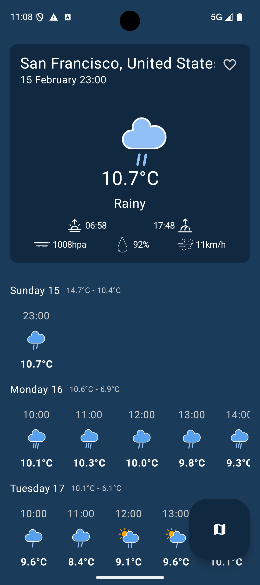
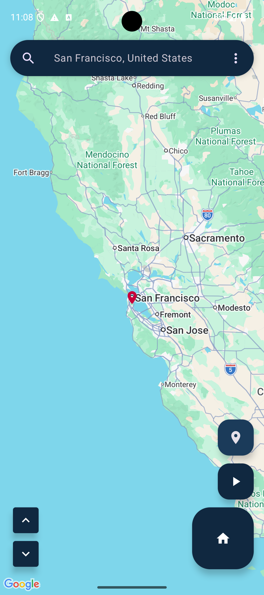
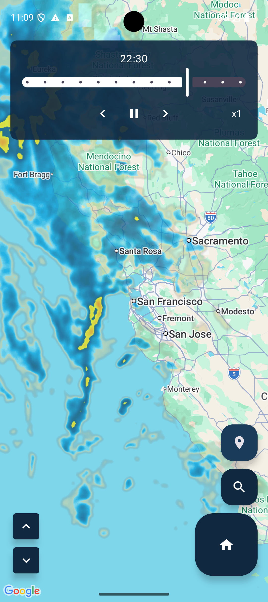
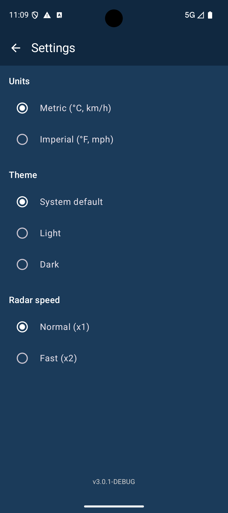

# Weekly Weather

## Overview

Weekly Weather provides a clean, intuitive interface for viewing weather forecasts for your current location and saved favorite places. The app is designed to be straightforward and user-friendly while providing accurate weather information.

## Features

- View detailed weekly weather forecasts
- Automatically detect current location
- Search and save favorite locations for quick access
- Custom naming for GPS locations
- Interactive radar map with animated precipitation overlay
- Configurable units (metric/imperial), theme, and radar speed
- Available in 37 languages
- Lightweight and battery-efficient

## Screenshots

| Weather | Map | Radar | Settings |
|:---:|:---:|:---:|:---:|
|  |  |  |  |

## Download

[](https://play.google.com/store/apps/details?id=com.arklan.weather)

## Credits

- Weather data provided by [Open-Meteo](https://open-meteo.com/)
- Weather icons from [Makin-Things/weather-icons](https://github.com/Makin-Things/weather-icons)

## Source

This application is open source and available at [repo.codeskraps.com](https://repo.codeskraps.com/codeskraps/Weekly-Weather).

## License

Weekly Weather is licensed under the MIT License.

```
MIT License

Copyright (c) 2025 Codeskraps

Permission is hereby granted, free of charge, to any person obtaining a copy
of this software and associated documentation files (the "Software"), to deal
in the Software without restriction, including without limitation the rights
to use, copy, modify, merge, publish, distribute, sublicense, and/or sell
copies of the Software, and to permit persons to whom the Software is
furnished to do so, subject to the following conditions:

The above copyright notice and this permission notice shall be included in all
copies or substantial portions of the Software.

THE SOFTWARE IS PROVIDED "AS IS", WITHOUT WARRANTY OF ANY KIND, EXPRESS OR
IMPLIED, INCLUDING BUT NOT LIMITED TO THE WARRANTIES OF MERCHANTABILITY,
FITNESS FOR A PARTICULAR PURPOSE AND NONINFRINGEMENT. IN NO EVENT SHALL THE
AUTHORS OR COPYRIGHT HOLDERS BE LIABLE FOR ANY CLAIM, DAMAGES OR OTHER
LIABILITY, WHETHER IN AN ACTION OF CONTRACT, TORT OR OTHERWISE, ARISING FROM,
OUT OF OR IN CONNECTION WITH THE SOFTWARE OR THE USE OR OTHER DEALINGS IN THE
SOFTWARE.