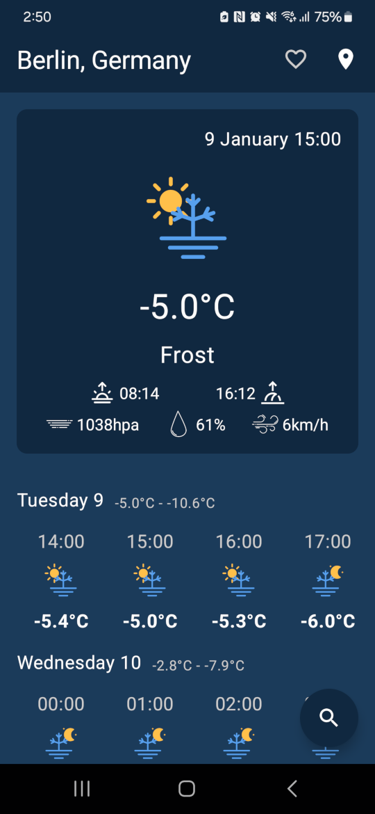
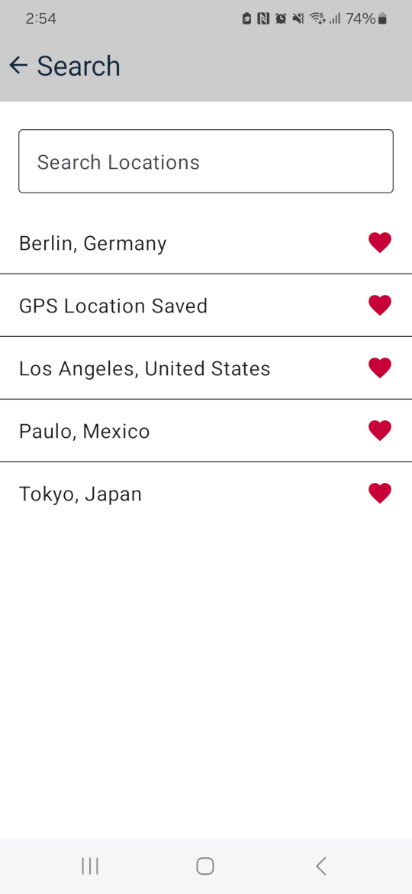

# Weekly Weather

## Overview

Weekly Weather provides a clean, intuitive interface for viewing weather forecasts for your current location and saved favorite places. The app is designed to be straightforward and user-friendly while providing accurate weather information.

## Features

- View detailed weekly weather forecasts
- Automatically detect current location
- Search and save favorite locations for quick access
- Custom naming for GPS locations
- Available in 37 languages
- Lightweight and battery-efficient

## Screenshots

## Download

## Credits

- Weather data provided by [Open-Meteo](https://open-meteo.com/)
- Weather icons from [Makin-Things/weather-icons](https://github.com/Makin-Things/weather-icons)

## Source

This application is open source and available on [GitHub](https://github.com/codeskraps/Weekly-Weather).