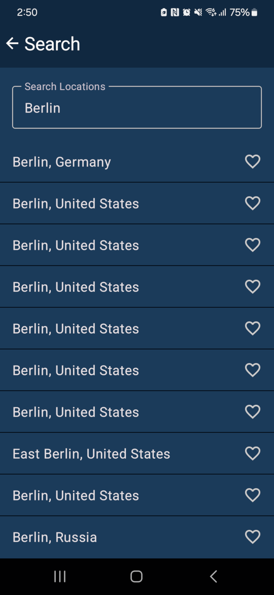

# Weekly-Weather

A quick view of your weekly weather

A quick overview of you weekly weather of your current location or search and save your favourite locations for easy access.

Save a GPS weather location with a custom name.

App translated into 37 languages.

Weather data API -> https://open-meteo.com/
Open Sourced -> https://github.com/codeskraps/Weekly-Weather